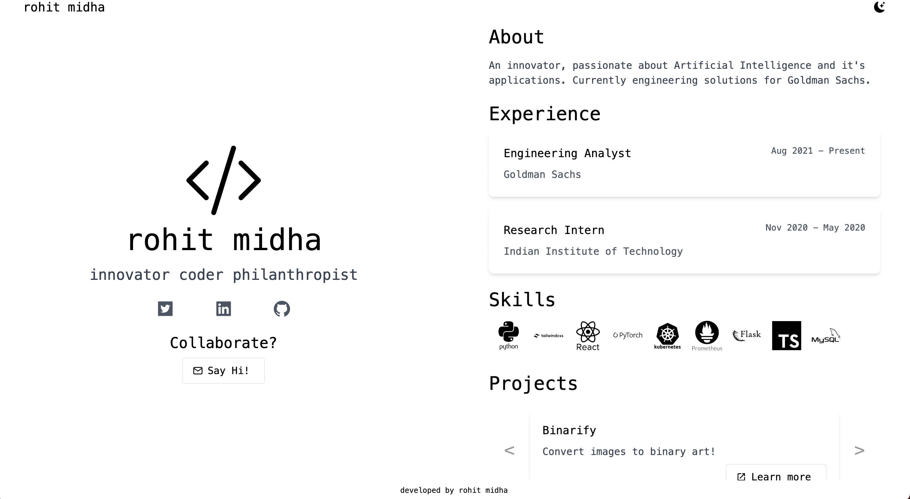
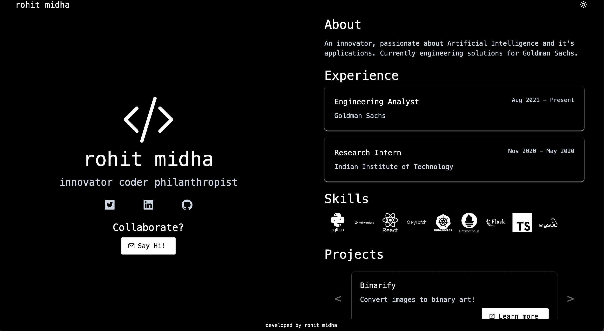

# Developer Portfolio

[**Check out Mine!**](https://portfolio-rohitmidha23.vercel.app/)

This bad boy is designed to help you create a professional portfolio website that will make your competition quiver. With its sleek design and easy customization options, you'll have your portfolio up and running in no time.

## Light Mode

## Dark Mode

- [Developer Portfolio](#developer-portfolio)
  - [Light Mode](#light-mode)
  - [Dark Mode](#dark-mode)
- [Developer Details](#developer-details)
  - [Get your Hands Dirty](#get-your-hands-dirty)
- [Support Me](#support-me)

# Developer Details

The template is built using Next.js, a popular React framework for building web apps.

It can be easily deployed on Vercel, a powerful platform for hosting web apps.

It uses tailwind-css so you have a portfolio that is fully responsive and optimized for all screen sizes.

## Get your Hands Dirty

1. Fork or clone this repository.
2. Run `npm install` to install the necessary dependencies.
3. Edit the `portfolio.json` file to add your own information and projects.
4. Start your local development server by running `npm run dev`.
5. Deploy the template by connecting the app to Vercel.

# Support Me

If you :heart: it, :star: this repo.

Help me translate this README into other languages. :smile:

Check out my other work too either on [Github](http://bit.ly/2VMv9ZP) or on [my website](https://rohitmidha23.github.io).

Enjoy!
